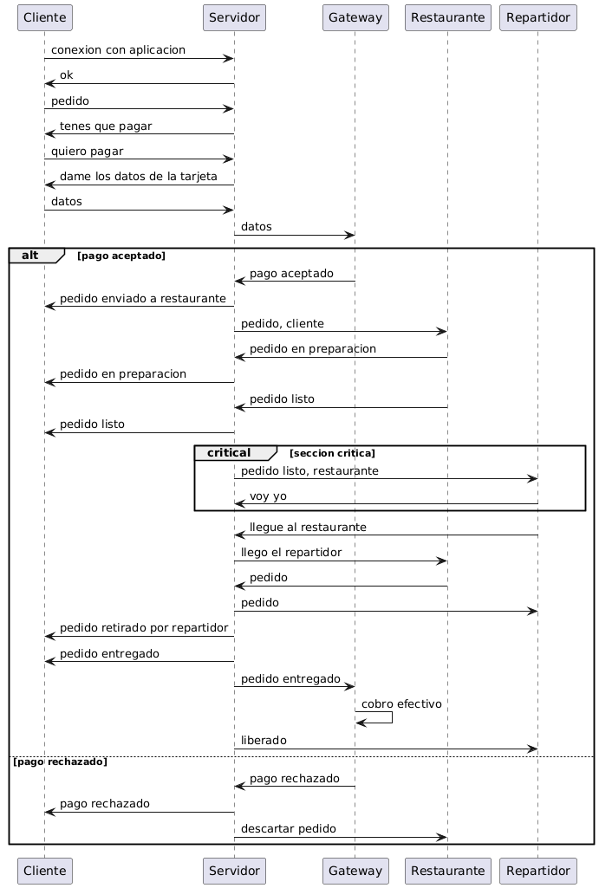

# Trabajo Práctico Nº2 'PedidosRust'

## Materia: Programación Concurrente (TB026)

## Grupo 'Consecutivo'

### Integrantes:

| Alumno                  | Correo                | Padrón  |
|-------------------------|-----------------------|---------|
| Ascencio Felipe Santino | fascencio@fi.uba.ar   | 110675  |
| Dominguez Santiago      | sadominguez@fi.uba.ar | 110010  |
| Guerrero Martín         | mguerrero@fi.uba.ar   | 107774  |
| Zielonka Axel           | azielonka@fi.uba.ar   | 110310  |

---

# TP2 - Pedidos Rust

A continuación se presenta el informe del trabajo práctico, asi como su composición y funcionamiento general.

## Graficos de ejecución

## Estructura general

El gráfico representa la estructura general del sistema.

Cada entidad se comunica únicamente con el servidor de forma activa (excepto el 'Gateway' que lo hace en forma pasiva como respuesta a mensajes externos que le envía el mismo) intercambiando mensajes.

### Observaciones del servidor 
- Procesa los mensajes de forma 'Secuencial' (para cumplir los principios del 'Modelo de Actores').
- Tiene una arquitectura de 2 niveles (no hay capas intermedias entre clientes y el servidor).

## Actores presentes en el sistema

### Protocolo elegido

Para nuestra aplicación utilizaremos el protocolo TCP, ya que ofrece una gestión eficiente de los paquetes y simplifica el manejo de los mensajes. Su principal ventaja es garantizar que cada mensaje entre los distintos actores llegue completo, en el orden correcto y sin pérdidas.

Los mensajes estarán estructurados con una longitud fija, lo que permite un procesamiento más directo en ambos sentidos, sin necesidad de definir delimitadores para el inicio o fin del mensaje. Cada mensaje incluirá un encabezado fijo que indicará el tipo de mensaje y su contenido.

### Servidor

**Finalidad:**  
Coordinar la comunicación entre los actores del sistema (comensales, restaurantes, repartidores, gateway), gestionar el 
ciclo de vida de los pedidos y facilitar la distribución eficiente de mensajes.

**Estado interno:**  
- Lista de pedidos en curso.  
- Mapeo de pedidos con sus respectivos comensales, restaurantes y repartidores.  
- Información temporal de autorizaciones de pago.  
- Ubicación de actores (para filtrar y minimizar mensajes según cercanía).

**Mensajes que recibe:**  
- `conexion con aplicación`: De un comensal que se conecta.  
- `pedido`: Solicitud de pedido nuevo.  
- `quiero pagar` / `datos`: Inicio del flujo de pago.
- `pago aceptado` / `pago rechazado`: Resultado del gateway de pagos.  
- `pedido listo`: Notificación del restaurante.  
- `voy yo`: Aceptación del pedido por un repartidor.  
- `llegue al restaurante`, `pedido retirado`, `pedido entregado`: Eventos del repartidor.

**Mensajes que envía:**  
- `ok`: Confirma conexión con un comensal.  
- `tenes que pagar`: Informa que debe autorizar el pago.  
- `pedido enviado a restaurante`: Notifica al comensal.  
- `pedido, cliente`: Envía nuevo pedido al restaurante.  
- `pedido en preparación` / `pedido listo`: Propaga eventos del restaurante al comensal.  
- `pedido listo, restaurante`: Oferta de pedido a repartidores cercanos.  
- `pedido entregado`: Confirma entrega al comensal.  
- `cobro efectivo`: Solicita al gateway procesar el cobro final.  
- `liberado`: Indica que se completó el proceso.  
- `descartar pedido`: Al restaurante, en caso de pago rechazado.

**Casos de interés:**  
- Implementación eficiente del filtrado por cercanía para repartir pedidos solo a repartidores próximos.  
- Manejo de condiciones de carrera (por ejemplo, varios repartidores aceptando el mismo pedido).  
- Resiliencia ante fallas: debe tolerar desconexiones temporales y recuperar estado.  
- Centralización lógica sin convertirse en cuello de botella gracias al modelo de actores y mensajes asincrónicos.

### Comensal

**Finalidad:**  
Realizar un pedido a un restaurante cercano, autorizar el pago, y mantenerse informado sobre el estado del mismo 
(en preparación, listo, en camino, entregado).

**Estado interno:**  
- Ubicación (coordenadas enteras).  
- Estado actual del pedido (`sin_pedido`, `esperando_pago`, `pagado`, `en_preparación`, `listo`, `en_camino`, 
`entregado`, `rechazado`).  
- Datos del pedido (monto, restaurante elegido).  
- Resultado de la autorización de pago.

**Mensajes que recibe:**  
- `ok`: Confirmación de conexión.  
- `tenes que pagar`: El servidor indica que se debe autorizar el pago.  
- `pedido enviado a restaurante`: Confirmación de que el pedido fue procesado y está en curso.  
- `pedido en preparación`: El restaurante comenzó a cocinar.  
- `pedido listo`: El restaurante finalizó el pedido.  
- `pedido entregado`: El repartidor completó la entrega.  
- `pago rechazado`: El gateway de pagos rechazó la autorización.

**Mensajes que envía:**  
- `conexion con aplicación`: Inicializa la interacción con el sistema.  
- `pedido`: Solicitud de pedido con restaurante y monto.  
- `quiero pagar`: Inicio del proceso de autorización de pago.  
- `datos`: Envío de los datos de la tarjeta al gateway.

**Casos de interés:**  
- Modelar múltiples comensales concurrentemente haciendo pedidos.  
- Simulación de rechazo de pago con reintento o cancelación.  
- Comunicación asincrónica para recibir eventos de estado del pedido.  
- Tolerancia a fallas: un comensal puede volver a conectarse y consultar el estado del pedido si se reinicia 
su instancia.

### Restaurante

**Finalidad:**  
Gestionar pedidos entrantes, preparar los mismos y notificar al servidor cuando estén listos para ser retirados por un 
repartidor.

**Estado interno:** 
- Lista de pedidos en preparación.
- Estado de cada pedido (en preparación, listo, cancelado).
- Información del restaurante (ubicación, nombre, etc.).

**Mensajes que recibe:**  
- `pedido`: Solicitud de un nuevo pedido del servidor.
- `llego el repartidor`: Notificación de que llegó al restaurante.

**Mensajes que envía:** 

- `pedido en preparación`: Notificación al servidor de que comenzó a preparar un pedido.
- `pedido listo`: Notificación al servidor de que el pedido está listo para ser retirado.
- `pedido cancelado`: Notificación al servidor si el pedido no puede ser preparado, (no hay ingredientes, etc.).

**Casos de interes:**

- Manejo de múltiples pedidos concurrentes.
- Simulación de tiempos de preparación aleatorios.
- Resiliencia ante fallas: si el restaurante se cae, debe poder reanudar pedidos pendientes al reiniciar.

### Repartidor

**Finalidad:**  
Recibir pedidos de restaurantes cercanos, aceptar los mismos y realizar la entrega al comensal.

**Estado interno:**

- Ubicación (coordenadas enteras).
- Estado actual del repartidor (`disponible`, `ocupado`).
- Pedido actual (si está en curso).

**Mensajes que recibe:**

- `pedido listo, restaurante`: Oferta de un nuevo pedido del servidor.
- `pedido <id>`: Confirmación de que aceptó un pedido.
- `estas liberado`: Notificación de que el pedido fue entregado y puede aceptar otro.

**Mensajes que envía:**

- `voy yo`: Aceptación del pedido.
- `llegue al restaurante`: Notificación de llegada al restaurante.
- `pedido entregado`: Notificación de que retiró el pedido.

**Casos de interes:**

- Simulación de múltiples repartidores concurrentes.
- Manejo de rechazos de pedidos si el repartidor no puede aceptar.
- Resiliencia ante fallas: si el repartidor se cae, debe poder reanudar su estado al reiniciar.

### Gateway

**Finalidad:** 
Simula un gateway de pagos que autoriza o rechaza operaciones de pago al momento de iniciar un pedido, y ejecuta el cobro efectivo al finalizar la entrega. Su comportamiento es probabilístico, pudiendo rechazar pagos en la etapa de autorización con una determinada probabilidad.

**Estado interno:**
- Probabilidad de rechazo de autorización (fija o configurable).
- Log de transacciones realizadas y sus resultados.

**Mensajes que recibe:**
- `AutorizarPago(monto, id_pedido)`: Solicita autorización para una tarjeta.  
- `Cobrar(monto, id_pedido)`: Indica que debe ejecutarse el cobro tras la entrega.

**Mensajes que envía:**
- `AutorizacionExitosa(id_pedido)` o `AutorizacionRechazada(id_pedido)`: Respuesta al comensal/servidor tras la autorización.  
- `CobroConfirmado(id_pedido)`: Confirma el cobro una vez entregado el pedido.

**Casos de interes:**
- Rechazo aleatorio en la autorización inicial (simula tarjetas fallidas).  
- Permitir múltiples pedidos concurrentes sin pérdida de mensajes ni estados.  
- No es un actor crítico para la entrega, pero sí lo es para la continuidad del pedido.

## Intercambio de mensajes entre Actores

### Mensajes entre comensales y servidor:

### Mensajes entre restaurantes y servidor:

#### Mensajes entre repartidores y servidor:

### Mensajes entre gateway y servidor:

## Herramientas de concurrencia utilizadas

### Exclusión mutua

La utilización de un 'Algoritmo Centralizado' para la asignación de pedidos a repartidores resulta conveniente. 
El servidor central selecciona una cantidad determinada de repartidores cercanos y les envía la propuesta del pedido, 
permitiendo que uno de ellos lo acepte, asegurando así la exclusión mutua en la asignación.

Se optó por la alternativa del 'Algoritmo Centralizado' para reducir significativamente la cantidad de mensajes intercambiados (respetando la consigna brindada).

### Algoritmo de elección "Ring"

Ante la caída de una instancia del servidor, se utiliza el algoritmo de elección por anillo para determinar de forma 
distribuida cuál será el nuevo servidor líder. Este mecanismo permite iniciar el proceso de elección entre un conjunto 
predefinido de nodos.

### Token ring

Se emplea un esquema de Token Ring para compartir el estado interno del servidor líder con el resto de las instancias. 
De esta forma, en caso de falla del líder actual, el siguiente nodo en recibir el token estará en condiciones de asumir 
el rol sin pérdida de información.

### Diagrama de Ring de servidores

### Mecanismos de Persistencia

Para conseguir persistencia en los mensajes enviados por los distintos clientes, que todavía no proceso el servidor central, se implementa un sistema de archivos en el que los 'Hilos Escritores' de cada cliente, agregan los mensajes de cada entidad en los mismos, con 2 principales objetivos:
- Reducir la cantidad de información que circula por el 'Anillo de Servidores', ahorrando recursos del 'CPU'.
- Garantizar la persistencia de los pedidos una vez que cualquier instancia del 'Anillo de Servidores' consigue recibir el mensaje.

De esta forma se logra que los recursos que circulan por el anillo de servidores, sea simplemente la cantidad de conexiones activas que tiene actualemente el sistema.

---

# Segunda Entrega

## Actores presentes en el sistema

### Gateway de Pagos

**Finalidad:**  
Simular un servicio externo que autoriza o rechaza operaciones de pago al iniciar un pedido y procesa el cobro final cuando el pedido es entregado, agregando realismo y control sobre el flujo económico del sistema.

**Estado interno:**  
- Probabilidad de rechazo de autorización (configurable mediante constante).  
- No almacena pedidos ni transacciones a largo plazo (stateless), pero imprime log de cada operación para trazabilidad.  
- Gestión interna de los mensajes recibidos y enviados de manera asíncrona.

**Mensajes que recibe:**  
- `ValidarAutorizacionPago`: Solicitud de autorización de pago (envía el servidor al iniciar un pedido).  
- `EfectivizarPago`: Solicitud de cobro efectivo (envía el servidor al completar la entrega del pedido).

**Mensajes que envía:**  
- `RespuestaAutorizacion`: Responde si la autorización del pago fue aceptada o rechazada.  
- `PagoHecho`: Confirma que el cobro efectivo se realizó correctamente.

**Casos de interés:**  
- Simulación de rechazo de pagos mediante aleatoriedad controlada (probabilidad configurable).  
- Permitir múltiples solicitudes concurrentes gracias al modelo de actores y manejo asíncrono.  
- Logueo exhaustivo de eventos para facilitar debugging y seguimiento de la lógica de pagos.  
- No es un actor crítico para la entrega, pero sí para la continuidad y veracidad del flujo de pedidos.  
- Fácilmente escalable para permitir varios gateways y alta concurrencia en escenarios de stress.

### Elección de Coordinador (EleccionCoordinador)

**Finalidad:**  
Coordinar la elección dinámica de un nodo coordinador/líder en el sistema distribuido ante caídas, reinicios o cambios de topología, asegurando que siempre exista un único nodo central para la coordinación de pedidos y eventos críticos.

**Estado interno:**  
- Dirección propia (identificador único: `SocketAddr`).
- Dirección del coordinador actual (si la conoce).
- Referencia al actor coordinador local.
- Lista de peers conocidos en la red.
- Bandera de “en elección” para evitar condiciones de carrera.
- Gestión de intentos y reintentos de conexión para tolerancia a fallos.

**Mensajes que recibe:**  
- `IniciarEleccion`: Solicitud para arrancar una nueva elección.
- `MensajeEleccion`: Mensaje con la lista de candidatos circulando por el anillo.
- `MensajeCoordinador`: Anuncio del nodo coordinador elegido.
- `PingCoordinador`: Solicitud de verificación del estado del coordinador actual.
- `ObtenerDireccionCoordinador` / `ObtenerDireccionLider`: Consulta para saber quién es el coordinador actual.
- `SoyCoordinador`: Consulta si esta instancia es el coordinador.

**Mensajes que envía:**  
- `MensajeEleccion`: Envía a los siguientes peers la lista de candidatos para la elección.
- `MensajeCoordinador`: Broadcast al anillo anunciando el nuevo coordinador.
- Respuestas a pings y consultas (“WhoIsCoordinator”) para informar el estado actual.
- Internamente notifica a su coordinador local si debe asumir el liderazgo.

### TcpEnviador

**Finalidad:**  
Encapsular el envío de mensajes a través de una conexión TCP saliente, permitiendo a los actores del sistema comunicarse de forma asíncrona mediante el envío de mensajes serializados a través de sockets.

**Estado interno:**  
- Referencia opcional al canal de escritura (`WriteHalf<TcpStream>`) asociado a la conexión TCP.
- Maneja el ciclo de vida del canal de salida, detectando y gestionando errores de conexión (incluyendo desconexiones o "broken pipe").

**Mensajes que recibe:**  
- `MensajeTCP`: Mensaje con el contenido serializado (en formato texto) que debe enviarse por la conexión TCP.

**Mensajes que envía:**  
- No envía mensajes a otros actores, pero ejecuta la escritura sobre el socket TCP y reporta errores mediante logs o pánicos controlados.

**Casos de interés:**  
- Abstracción del envío TCP: permite separar la lógica de negocio de la lógica de transporte de bajo nivel.
- Facilita la reutilización y centralización del manejo de conexiones TCP en todo el sistema.
- Gestiona desconexiones y errores de red, permitiendo una recuperación más sencilla o el logueo de eventos críticos.
- Permite el envío de mensajes asíncronos desde distintos actores sin bloquear la ejecución principal.

**Casos de interés:**  
- Implementa el algoritmo de elección por anillo: garantiza unicidad y robustez en la elección del líder.
- Soporta tolerancia a fallas: si el coordinador cae, el sistema se recupera automáticamente.
- Permite integración transparente de nuevos nodos.
- Evita condiciones de carrera y duplicación de coordinadores mediante la gestión de la bandera de “en elección”.
- Garantiza que el sistema sigue funcionando correctamente incluso con conexiones caídas o peers intermitentes.

### Almacenamiento

**Finalidad:**  
Gestionar y mantener en memoria el estado actualizado de las entidades principales del sistema (comensales, restaurantes, repartidores), actuando como base de datos efímera y compartida para todos los actores que requieren información de estos elementos.

**Estado interno:**  
- HashMap de comensales (`SocketAddr` → entidad comensal).
- HashMap de repartidores (`SocketAddr` → entidad repartidor).
- HashMap de restaurantes (`SocketAddr` → entidad restaurante).

**Mensajes que recibe:**  
- Mensajes de alta, baja o actualización de comensales, repartidores y restaurantes.
- Solicitudes de consulta de estado o información de entidades por otros actores.
- Solicitudes para marcar entidades como ausentes, ocupadas, libres o inactivas según los eventos del sistema.

**Mensajes que envía:**  
- Respuestas con datos solicitados por otros actores (p. ej., ubicaciones, estado de disponibilidad).
- Confirmaciones de inserción, eliminación o modificación de entidades.
- Alertas o logs internos para debugging del sistema.

**Casos de interés:**  
- Permite mantener el estado global del sistema de forma centralizada, facilitando la coherencia y sincronización entre actores.
- Soporta concurrencia y acceso seguro mediante el modelo actor (sin necesidad de locks manuales).
- Simplifica la implementación de funcionalidades como filtrado por cercanía, disponibilidad de recursos y manejo de ausencias.
- Su diseño permite reiniciar fácilmente el estado para pruebas o simulaciones, ya que no persiste datos en disco.

### Restaurante

**Finalidad:**  
Gestionar pedidos entrantes provenientes del coordinador/servidor, preparar los pedidos, notificar el estado del pedido (aceptado/rechazado/listo), y solicitar un repartidor para la entrega una vez que el pedido está preparado.

**Estado interno:**  
- Lista de servidores (coordinadores) disponibles para conectarse.
- Lector y escritor de la conexión TCP (manejo de mensajes).
- Ubicación fija (coordenadas asignadas al crearse).
- Lista de clientes atendidos (para evitar procesar el mismo pedido dos veces).

**Mensajes que recibe:**  
- `RecibirPedido`: Notificación de un nuevo pedido proveniente del servidor (incluye datos del comensal y comida solicitada).

**Mensajes que envía:**  
- `MensajeIdentidad`: Envía su posición y rol al coordinador al conectarse.
- `RespuestaOfertaViaje`: Indica si acepta o rechaza el pedido recibido.
- `SolicitarRepartidor`: Solicita al servidor que un repartidor retire el pedido listo para entrega.
- Mensajes de estado/log (prints en consola para debugging).

**Casos de interés:**  
- Simulación de aceptación de pedidos con probabilidad configurable.
- Manejo de múltiples pedidos concurrentes y filtrado para evitar duplicados.
- Simulación de tiempos de preparación (delay aleatorio o fijo).
- Robustez ante fallos de red y reconexión automática para enviar notificaciones pendientes.
- Logs detallados para debugging y trazabilidad del ciclo de vida de cada pedido.

### Repartidor

**Finalidad:**  
Recibir pedidos listos para entrega, decidir de manera probabilística si acepta el viaje, y transportar la comida del restaurante al comensal. Realiza la entrega simulando el recorrido y reporta la finalización del pedido.

**Estado interno:**  
- Lista de servidores (coordinadores) a los que puede conectarse.
- Lector y escritor de la conexión TCP (para entrada/salida de mensajes).
- Ubicación actual (coordenadas aleatorias al inicio).

**Mensajes que recibe:**  
- `OfertarViaje`: El servidor ofrece un pedido disponible para que lo acepte.
- `IniciarViaje`: Indicación para iniciar el viaje de entrega de comida al comensal.

**Mensajes que envía:**  
- `RespuestaOfertaViaje`: Informa al servidor si acepta o rechaza el viaje ofrecido.
- `Posicion`: Notifica al servidor su ubicación actual al conectarse.
- `FinalizarViaje`: Informa al servidor la entrega finalizada al comensal (con coordenadas de destino).

**Casos de interés:**  
- Simulación de aceptación de viajes con probabilidad configurable.
- Manejo de reconexión ante fallos de red o caídas del servidor/coordinador.
- Simulación realista del tiempo de viaje (en base a la distancia y un retardo aleatorio).
- Logs útiles para debugging, mostrando todos los pasos clave de la entrega.
- Abstracción y robustez para permitir múltiples repartidores concurrentes en el sistema.

### Comensal

**Finalidad:**  
Realizar pedidos a restaurantes cercanos, interactuar con el servidor para solicitar comida, y mantenerse informado del estado de su pedido hasta la entrega.

**Estado interno:**  
- Lista de servidores disponibles para conexión.
- Lector y escritor asociados a la conexión TCP (manejan la entrada/salida de mensajes).
- Lógica interna para elegir aleatoriamente el pedido y para reconectarse ante fallos.

**Mensajes que recibe:**  
- Mensajes del servidor para iniciar el viaje (`IniciarViaje`).
- Mensaje de rechazo (`RechazarViaje`) si el restaurante no acepta el pedido.
- Mensajes genéricos informando eventos de la aplicación (ej. “viaje rechazado por restaurante”).

**Mensajes que envía:**  
- `SolicitarPedido`: Solicitud de un nuevo pedido (comida y destino aleatorios).
- `FinalizarViaje`: Informa al servidor la finalización del viaje/pedido.
- Mensaje de consulta (“WhoIsCoordinator”) para descubrir y conectar al coordinador.

**Casos de interés:**  
- Simulación de pedidos concurrentes y comunicación asíncrona con el servidor.
- Implementa lógica de reconexión automática ante caídas o fallas de red.
- Permite pruebas de robustez ante errores de comunicación (timeouts, server caído, etc).
- Elige de manera aleatoria el pedido y gestiona automáticamente los diferentes estados de su pedido.
- Es extensible para incorporar pagos, estados avanzados y nuevas funcionalidades según crezca el sistema.

### Servidor

**Finalidad:**  
Actuar como el punto central de comunicación y lógica de negocio entre los distintos actores del sistema.  
Recibe conexiones de comensales, restaurantes y repartidores, y gestiona el ciclo de vida de los pedidos (desde la solicitud hasta la entrega), además de coordinar con el actor de Elección de Coordinador y el almacenamiento de estado.

**Estado interno:**  
- Dirección propia (`addr`) y dirección del cliente conectado (`client_addr`).
- Referencia al actor `TcpEnviador` para envío de mensajes por socket.
- Referencias a los actores: `EleccionCoordinador`, `Coordinador` y `Almacenamiento`.
- Lógica para aceptar y gestionar nuevas conexiones entrantes.

**Mensajes que recibe (vía TCP o Actix):**  
- **Desde otros actores o TCP:**  
    - `MensajePing` / `"WhoIsCoordinator"`: Para chequeo de estado y consultas sobre liderazgo.
    - `MensajeEleccion` / `MensajeCoordinador`: Mensajes del algoritmo de elección de coordinador.
    - `SolicitarRepartidor` / `SolicitarPedido`: Pedidos de comensales o restaurantes.
    - `Posicion`: Actualización de ubicación de actores (restaurantes/repartidores).
    - `MensajeIdentidad`: Mensaje de identificación del actor conectado (es repartidor o no).
    - `FinalizarViaje`: Notificación de finalización de un viaje.
    - `HandlePedido`: Mensaje para manejar o actualizar un pedido.
    - `RespuestaOfertaViaje`: Respuesta a la oferta de un viaje (aceptado/rechazado).
    - `HacerPedido`: Solicitud interna de creación de un viaje/pedido.
    - `ActualizarComensales` / `ActualizarRepartidores`: Actualizaciones internas del coordinador.
    - `UpdateRepartidores`: Mensaje para actualización de repartidores disponibles.

**Mensajes que envía:**  
- **A través de `TcpEnviador`**:  
    - `MensajeTCP("Ack")`: Confirmación de recepción de mensajes importantes (elección, coordinación, etc).
    - Mensajes serializados a los actores conectados según el tipo de mensaje recibido/procesado.
- **Internos**:  
    - Envía mensajes a los actores de Elección, Coordinador y Almacenamiento según la lógica del flujo de pedidos, actualización de estado y propagación de eventos.
- **Log**:  
    - Prints/logs de funcionamiento para depuración y monitoreo del sistema.

**Casos de interés:**  
- Coordinación de todo el flujo: desde la llegada de un pedido hasta su entrega y cierre.
- Integración con el algoritmo de elección de coordinador para garantizar alta disponibilidad.
- Gestión concurrente de múltiples conexiones de clientes (comensales, restaurantes, repartidores) y procesamiento de eventos asíncronos.
- Tolerancia a fallos y robustez: manejo de desconexiones, reintentos y actualización automática del estado del sistema.
- Capacidad de propagación de cambios de estado y sincronización entre actores.

## Tutorial de uso

### Ejecutar manualmente

Para ejecutar el programa de forma manual simplemente basta con ejecutar los comandos que se listan a continuación luego de haber ejecutado 'cargo build':

#### Ejecutar una instancia del servidor con los 'logs del sistema de elección de líder'

- cargo run --features log_eleccion --bin servidor $PUERTO (Se permiten valores de puerto entre '8080' y '8084' inclusive).

#### Ejecutar una instancia del servidor con los 'logs de funcionamiento'

- cargo run --features log_funcionamiento --bin servidor $PUERTO (Se permiten valores de puerto entre '8080' y '8084' inclusive).

#### Ejecutar una instancia de comensal

- cargo run --bin comensal

#### Ejecutar una instancia del repartidor

- cargo run --bin repartidor

#### Ejecutar una instancia del restaurante

- cargo run --bin restaurante

### Scripts de prueba

Para facilitar el sistema de 'Testing/Pruebas' en nuestro proyecto se desarrollaron unos scripts que facilitan la ejecución de una, o múltiples instancias del mismo para verificar su funcionamiento sobre distintos escenarios y múltiples tipos de fallas.

#### Ejecutar una cantidad de instancias configurables de cada aplicación de usuario

- ./configurable.sh $CANTIDAD_DE_REPARTIDORES $CANTIDAD_DE_RESTAURANTESs $CANTIDAD_DE_COMENSALES

#### Ejecutar 4 instancias de cada una de las aplicaciones de usuario.

- ./4-4-4.sh

#### Ejecutar 5 instancias de servidor, con los 'logs de elección' activados, para ver de forma efectiva los procesos de elección

- ./eleccion.sh

#### Ejecutar 2 instancias del servidor mas una instancia del gateway

- ./servidores.sh

#### Ejecutar una instancia del servidor

- ./servidor.sh $PORT

#### Ejecutar una instancia del comensal

- ./comensal.sh

#### Ejecutar una instancia del repartidor

- ./repartidor.sh

#### Ejecutar una instancia del restaurante

- ./restaurante.sh

#### Ejecutar una instancia del gateway

- ./gateway.sh
